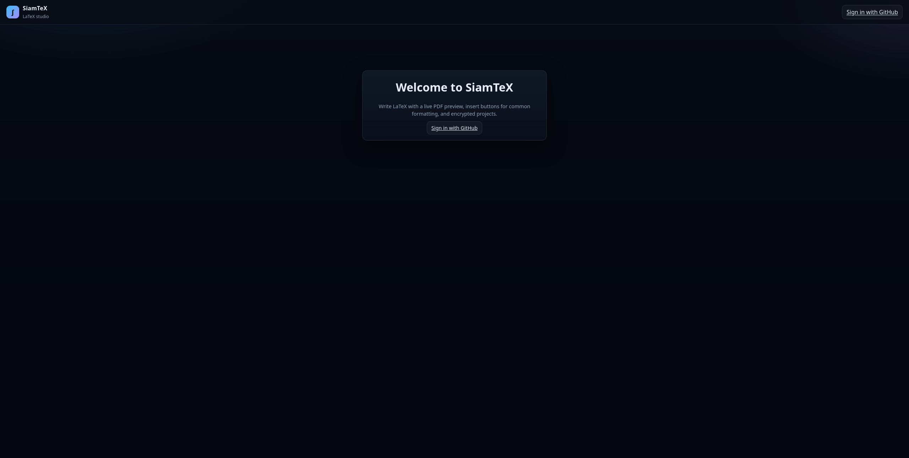

# SiamTeX

**Write serious LaTeX in the browser — compile to PDF beside your source, with encryption, templates, share links, and optional AI that runs on *your* hardware.**

SiamTeX is a security-minded LaTeX studio for **students finishing a thesis**, **researchers polishing a conference paper**, and **anyone** who wants professional typesetting without installing a full TeX stack on every device.

**Source:** https://github.com/wsams/siamtex

---

## Why SiamTeX?

LaTeX is still the gold standard for academic writing — but the toolchain is intimidating. SiamTeX lowers the floor while keeping the ceiling high:

| For students | For researchers & professionals |
|--------------|----------------------------------|
| Start from **homework** or **blank** templates with editable starter text | Multi-file **article** projects with `refs.bib` and natbib |
| **Toolbar inserts** for bold, headings, math, lists, tables — no memorizing `\begin{}` | Side-by-side **PDF preview** with debounced auto-compile |
| **Clickable compile errors** that jump to the offending line | Import/export **zip**, **share links**, page estimates, geometry tools |
| **AI fix problems** when the build breaks — review before applying | **Version history** with branching undo and diff-before-restore |
| Resume package with partials (experience, education, skills) | **AES-256-GCM encryption at rest** for sources and PDFs |

You get a real editor (CodeMirror), a sandboxed **Docker TeX worker** (`pdflatex`, `xelatex`, `lualatex`, BibTeX, Biber), and optional **GitHub OAuth** — or run in **local solo mode** on your own server with no sign-in wall.

---

## AI: home GPU or cloud APIs

> **Alpha / experimental.** AI assist and AI fix problems are early-stage. Accuracy, LaTeX correctness, and usefulness **depend on the model and provider you choose** (local Ollama, OpenAI, Gemini, etc.). Always review output before accepting — SiamTeX does not guarantee valid fixes or good edits.

SiamTeX does **not** need a GPU on the server. Common setups:

```
Path A (self-hosted):  Browser → VPS → Tailscale → Ollama at home
Path B (cloud API):    Browser → VPS → OpenAI / Gemini / Grok / OpenRouter
```

| Path | Best for |
|------|----------|
| **Tailscale + Ollama** | Modest VPS + GPU at home; no per-token cloud bill | [INSTALL_DO.md](./INSTALL_DO.md) · [docs/tailscale-ollama.md](./docs/tailscale-ollama.md) |
| **OpenAI, Gemini, Grok** | No home server; pay-as-you-go API | [docs/ai-providers.md](./docs/ai-providers.md) |
| **Claude (Anthropic)** | Via **OpenRouter** or OpenAI-compatible proxy | [docs/ai-providers.md](./docs/ai-providers.md) |

**In the app:** AI assist · AI fix compile problems · progress UI · version history.

Traffic path: **browser → your PHP server → provider you configure** (never browser → home Ollama directly).

**Agent install:** say which provider in your prompt — see [docs/ai-providers.md](./docs/ai-providers.md) for env recipes. Architecture: [AI.md](./AI.md).

---

## Screenshots

**Welcome & sign-in** — GitHub OAuth when you want it, or run locally without a sign-in wall.



**Project dashboard** — your work, templates for articles, homework, and resumes, import/export zip.


**Editor + live PDF** — multi-file projects, toolbar inserts, compile errors you can click, preview beside your source.


**Add files & assets** — upload images, spin up `.tex` partials, bibliographies, and sections without leaving the browser.


---

## Features

- Multi-file projects with syntax-highlighted editor and beginner insert toolbar
- Live PDF preview and structured compile diagnostics (file, line, severity)
- Curated templates: blank, homework, resume (multi-file), academic article
- Import / export zip · share links · author tools (page estimate, geometry)
- Encrypted storage for project files and compiled PDFs
- GitHub OAuth optional · local solo mode when OAuth is unset
- **AI assist** and **AI fix compile problems** *(alpha — quality depends on your model)*; server-configured Ollama or BYOK
- **Per-file version history** — branching undo tree, diff preview, restore

Details: [SPECS.md](./SPECS.md) · AI architecture & BYOK: [AI.md](./AI.md)

---

## Install

| Guide | Best for |
|-------|----------|
| **[INSTALL_DO.md](./INSTALL_DO.md)** | **DigitalOcean** — prerequisites, DNS (any registrar), PHP/Apache/Docker, Certbot TLS, optional AI |
| **[docs/ai-providers.md](./docs/ai-providers.md)** | **AI setup** — OpenAI, Gemini, Grok, OpenRouter/Claude, Ollama (any host) |
| **[AGENTS.md](./AGENTS.md)** | Any Linux server — full runbook for AI coding agents |
| **[config/](./config/README.md)** | Sample vhost, env, `.htaccess`, php-fpm drop-in |

**Cursor:** use the project skill `.cursor/skills/install-siamtex/` or paste the prompt from AGENTS.md.

**Requirements (compile server):** PHP 8.2+, Composer, Docker, **2 GB+ RAM**, **40 GB+ disk** ([SPECS.md §6.2](./SPECS.md)). AI inference is optional and typically runs elsewhere.

---

## Project layout

| Path | Purpose |
|------|---------|
| `index.php` | App shell |
| `api/` | JSON, PDF, auth, AI, and history endpoints |
| `src/` | PHP domain logic |
| `templates/` | Curated starter packages |
| `config/` | Sample server configs (not secrets) |
| `docs/` | Screenshots, Tailscale guide (**blocked from HTTP on deploy**) |
| `INSTALL_DO.md` | DigitalOcean install (+ optional home GPU) |
| `docs/ai-providers.md` | AI provider env recipes for agents |
| `AGENTS.md` | Agent + operator install runbook |
| `data/` | SQLite, encrypted projects (**gitignored**) |

---

## Contributing

Bug fixes, templates, and UX improvements welcome — see [CONTRIBUTING.md](./CONTRIBUTING.md).

Licensed under the [MIT License](./LICENSE).

---

*From first homework set to camera-ready paper — compile on a small VPS, think with a model at home, and keep every revision on the timeline.*
