# SiamTeX

**Write serious LaTeX in the browser — compile to PDF beside your source, with encryption, templates, share links, and optional AI that runs on *your* hardware.**

SiamTeX is a security-minded LaTeX studio for **students finishing a thesis**, **researchers polishing a conference paper**, and **anyone** who wants professional typesetting without installing a full TeX stack on every device.

**Source:** https://github.com/wsams/siamtex

---

## Why SiamTeX?

LaTeX is still the gold standard for academic writing — but the toolchain is intimidating. SiamTeX lowers the floor while keeping the ceiling high:

| For students | For researchers & professionals |
|--------------|----------------------------------|
| Start from **homework** or **blank** templates with editable starter text | Multi-file **article** projects with `refs.bib` and natbib |
| **Toolbar / Insert menus** for bold, headings, math, lists, tables — no memorizing `\begin{}` | Side-by-side **PDF preview** with debounced auto-compile |
| **Multiple PDFs** — compile top-level files like `main.tex` and `cover-letter.tex` separately | Import/export **zip**, **share links**, page estimates, geometry tools |
| **Clickable compile errors** that jump to the offending line | **Version history** with branching undo and diff-before-restore |
| **AI fix problems** when the build breaks — review before applying | **AES-256-GCM encryption at rest** for sources and PDFs |
| Resume package with partials (experience, education, skills) | |

You get a real editor (CodeMirror), a sandboxed **Docker TeX worker** (`pdflatex`, `xelatex`, `lualatex`, BibTeX, Biber), and optional **GitHub OAuth** — or run in **local solo mode** on your own server with no sign-in wall.

---

## AI: home GPU or cloud APIs

> **Alpha / experimental.** AI assist and AI fix problems are early-stage. Accuracy, LaTeX correctness, and usefulness **depend on the model and provider you choose** (local Ollama, OpenAI, Gemini, etc.). Always review output before accepting — SiamTeX does not guarantee valid fixes or good edits.

SiamTeX does **not** need a GPU on the server. Common setups:

```
Path A (self-hosted):  Browser → VPS → Tailscale → Ollama at home
Path B (cloud API):    Browser → VPS → OpenAI / Gemini / Grok / OpenRouter
```

| Path | Best for |
|------|----------|
| **Tailscale + Ollama** | Modest VPS + GPU at home; no per-token cloud bill | [INSTALL_DO.md](./INSTALL_DO.md) · [docs/tailscale-ollama.md](./docs/tailscale-ollama.md) |
| **OpenAI, Gemini, Grok** | No home server; pay-as-you-go API | [docs/ai-providers.md](./docs/ai-providers.md) |
| **Claude (Anthropic)** | Via **OpenRouter** or OpenAI-compatible proxy | [docs/ai-providers.md](./docs/ai-providers.md) |

**In the app:** **AI chat** (Q&A with `@file` context) · **AI assist** · **AI fix compile problems** · **create project from prompt** · progress UI · version history.

Traffic path: **browser → your PHP server → provider you configure** (never browser → home Ollama directly).

### Administrator-controlled AI

On multi-user hosts, **AI is managed by an administrator** — not automatically on for everyone.

| Control | How it works |
|---------|----------------|
| **Server switch** | `SIAMTEX_AI_ENABLED=0` disables AI for the whole instance |
| **Per-user features** | Admins (`SIAMTEX_ADMIN_GITHUB_LOGINS`) use **AI access** in the app to enable Chat, Create project, Assist, Fix errors, and BYOK settings per account |
| **Default for new users** | All AI features **off** until granted |
| **Token quotas** | Optional per-user cap; blank = unlimited. Enforced before each AI call |
| **Usage visibility** | **AI access** shows tokens used per user (including admins) and **all-users total** |

Provider setup: [docs/ai-providers.md](./docs/ai-providers.md) · architecture: [AI.md](./AI.md).

---

## Screenshots

Click any image for the full-size capture. Thumbnails keep the README readable on GitHub.

### Getting started

**Welcome & sign-in** — GitHub OAuth when you want it, or run locally without a sign-in wall.

<a href="docs/screenshots/not-signed-in.png">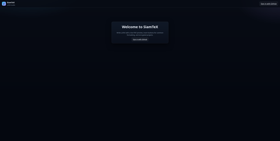</a>

**Project dashboard** — your work, templates for articles, homework, and resumes, import/export zip.

<a href="docs/screenshots/signed-in-dashboard.png">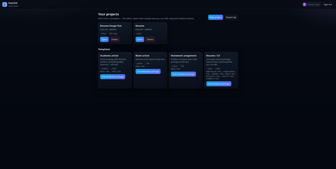</a>

**Editor + live PDF** — multi-file projects, Insert menus for common LaTeX, compile errors you can click, preview beside your source.

<a href="docs/screenshots/edit-document.png">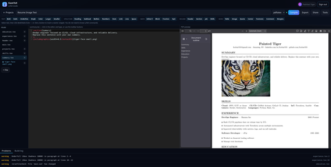</a>

**Add files & assets** — upload images, spin up `.tex` partials, bibliographies, and sections without leaving the browser.

<a href="docs/screenshots/upload-files.png">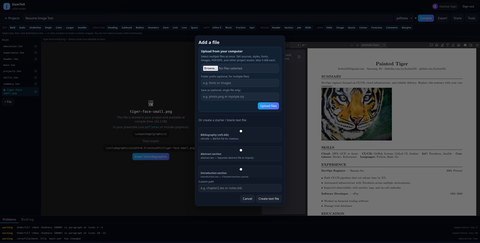</a>

### AI chat — math from a question *(alpha)*

Separate from the structured **AI** edit tools: open **Chat**, ask how to typeset something in plain language, and copy the LaTeX from the reply’s code block into your document. Compile to see the rendered math in the PDF preview — no need to memorize `\frac` or environment syntax.

<a href="docs/screenshots/chat-01-math-via-chat.png">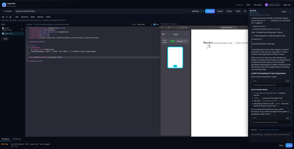</a>

### AI assist *(alpha)*

End-to-end example: ask the model to turn a blank article into a pancake recipe, review the suggestion, accept, and compile. AI runs on the provider you configure (here, Ollama over Tailscale).

**1. New project** — pick a template and name; *Blank article* is enough when the AI will write the body.

<a href="docs/screenshots/ai-01-new-project.png">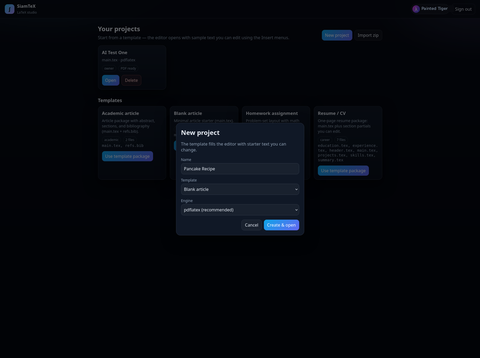</a>

**2. Starter editor** — default `main.tex` and an empty PDF preview before you invoke AI.

<a href="docs/screenshots/ai-02-blank-editor.png">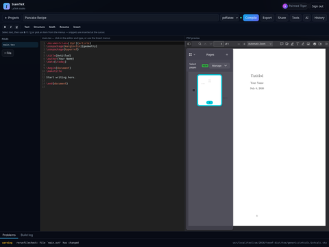</a>

**3. AI assist dialog** — click **AI**, choose scope (*Current file* or whole project), type a plain-English instruction, optional reference text, or a preset (*Polish*, *Fix LaTeX*, *Expand*).

<a href="docs/screenshots/ai-03-ai-dialog.png">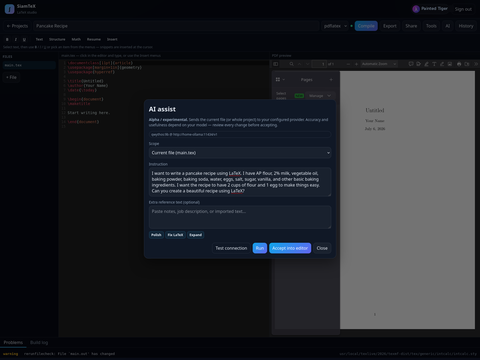</a>

**4. While it runs** — progress UI with elapsed time and cancel; local models over Tailscale may take a minute or two.

<a href="docs/screenshots/ai-04-ai-running.png">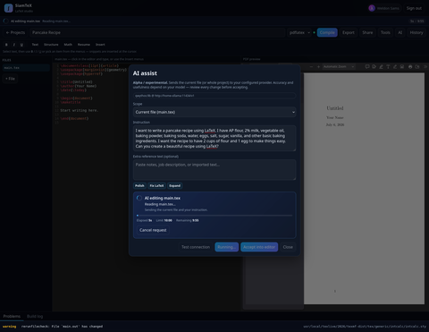</a>

**5. Review suggestion** — read the proposed LaTeX in the preview; click **Accept into editor** only when it looks right.

<a href="docs/screenshots/ai-05-ai-suggestion.png">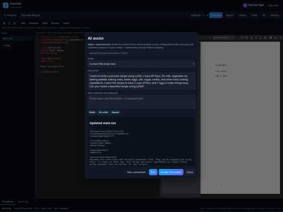</a>

**6. After accept** — updated source in the editor and a rendered PDF from **Compile** (auto-compile also runs after accept).

<a href="docs/screenshots/ai-06-pdf-result.png">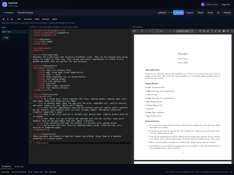</a>

### Upload an image, insert it with AI, resize in place

Continuing the pancake-recipe project: upload a photo, ask AI to place it in the document, then tweak the layout — still with review-before-accept at every step.

**7. Upload the asset** — use **+ File → Choose files…** to add `pancakes.png` to the project (shows in the file list beside `main.tex`).

<a href="docs/screenshots/wf-01-photo-uploaded.png">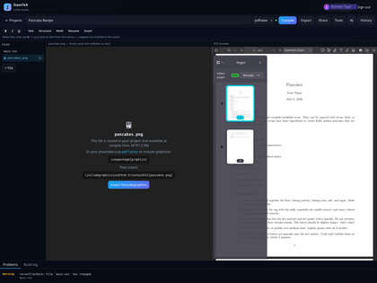</a>

**8. Ask AI to insert the figure** — open **AI**, keep scope on the current file, and describe placement (centered, border, padding, etc.). The model sees your uploaded filename.

<a href="docs/screenshots/wf-02-ai-insert-photo.png">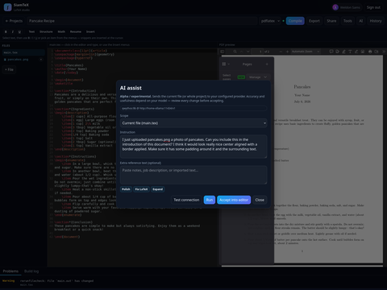</a>

<table>
<tr>
<td width="50%" valign="top">
<strong>9a. While it runs</strong> — progress UI while the model edits <code>main.tex</code>.<br/>
<a href="docs/screenshots/wf-03-ai-processing.png">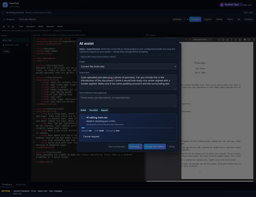</a>
</td>
<td width="50%" valign="top">
<strong>9b. Review the suggestion</strong> — <code>\includegraphics</code>, figure environment, etc. Accept only when it looks right.<br/>
<a href="docs/screenshots/wf-04-ai-suggestion-insert.png">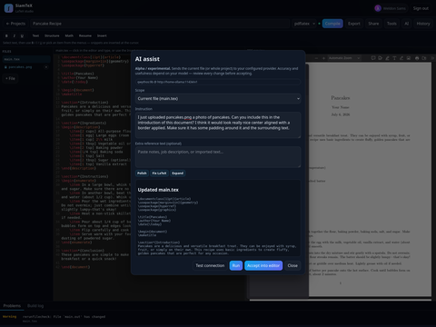</a>
</td>
</tr>
</table>

**10. Photo in the PDF** — after accept and compile, the introduction shows the centered image with a border.

<a href="docs/screenshots/wf-05-pdf-with-photo.png">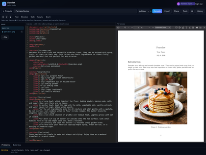</a>

<table>
<tr>
<td width="50%" valign="top">
<strong>11a. Resize request</strong> — tell AI the image is too large and ask for a smaller width.<br/>
<a href="docs/screenshots/wf-06-ai-resize-request.png">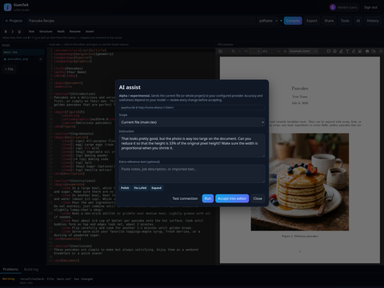</a>
</td>
<td width="50%" valign="top">
<strong>11b. Suggested tweak</strong> — updated <code>width=</code> or similar in the figure code.<br/>
<a href="docs/screenshots/wf-07-ai-resize-suggestion.png">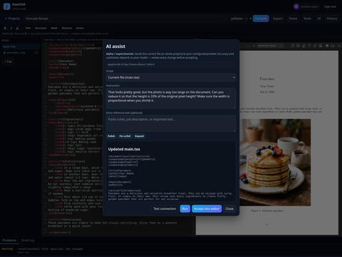</a>
</td>
</tr>
</table>

**12. Smaller figure in the PDF** — accept, recompile, and the photo fits the page better.

<a href="docs/screenshots/wf-08-pdf-resized.png"></a>

### Fix a broken compile with AI

To demo recovery, the document was intentionally broken. **Problems** lists the error; **AI fix problems** sends diagnostics and affected files to your model.

**13. Good state before the break** — the recipe with a working figure, for comparison when browsing history later.

<a href="docs/screenshots/wf-16-before-break.png">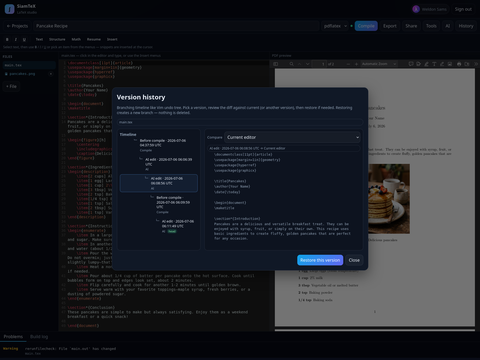</a>

<table>
<tr>
<td width="50%" valign="top">
<strong>14a. Compile error</strong> — structured problem in the bottom panel (file, line, message).<br/>
<a href="docs/screenshots/wf-09-compile-error.png">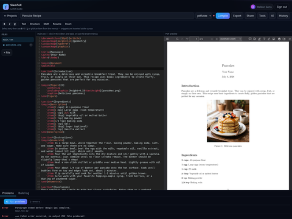</a>
</td>
<td width="50%" valign="top">
<strong>14b. AI fix dialog</strong> — click <strong>AI fix problems</strong>; review the listed errors before running.<br/>
<a href="docs/screenshots/wf-10-ai-fix-dialog.png">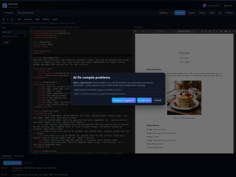</a>
</td>
</tr>
</table>

<table>
<tr>
<td width="50%" valign="top">
<strong>15a. Analyzing</strong> — AI reads the build log and source, then proposes a minimal fix.<br/>
<a href="docs/screenshots/wf-11-ai-fix-running.png">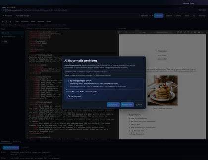</a>
</td>
<td width="50%" valign="top">
<strong>15b. Suggested fix</strong> — corrected LaTeX in the preview; accept to apply and recompile.<br/>
<a href="docs/screenshots/wf-12-ai-fix-suggestion.png">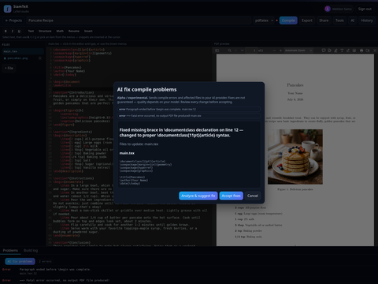</a>
</td>
</tr>
</table>

**16. Building again** — after accepting the fix, the PDF preview returns and the error clears from **Problems**.

<a href="docs/screenshots/wf-13-pdf-fixed.png">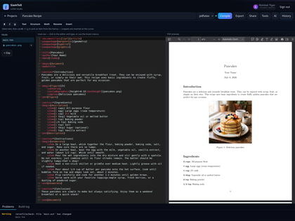</a>

### Version history (branching undo tree)

Every save, AI accept, and restore creates a node on a **per-file timeline** — like Vim’s undo tree. Pick any revision, diff against the current editor (or another version), then restore; restoring branches forward instead of deleting history.

<table>
<tr>
<td width="50%" valign="top">
<strong>17a. Timeline</strong> — open <strong>History</strong> to see branches for <code>main.tex</code>.<br/>
<a href="docs/screenshots/wf-14-history-dialog.png">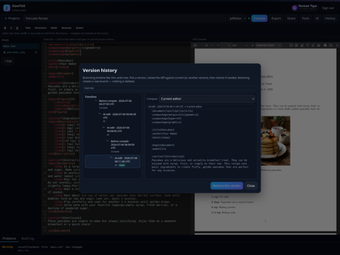</a>
</td>
<td width="50%" valign="top">
<strong>17b. Diff before restore</strong> — inspect the AI fix (or any edit) line-by-line before jumping back.<br/>
<a href="docs/screenshots/wf-15-history-diff-fix.png">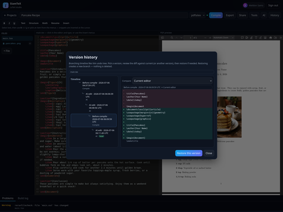</a>
</td>
</tr>
</table>

Restore an older node to continue from that point; nothing is erased — a new branch grows from the revision you chose.

---

## Features

- Multi-file projects with syntax-highlighted editor and Insert menus for common LaTeX
- Live PDF preview and structured compile diagnostics (file, line, severity)
- **Multiple compile entries** — each top-level `.tex` (e.g. `main.tex`, `cover-letter.tex`) builds its own PDF; preview follows the active file
- Curated templates: blank, homework, resume (multi-file), academic article
- Import / export zip · share links · author tools (page estimate, geometry)
- Encrypted storage for project files and compiled PDFs (per-entry PDF blobs)
- GitHub OAuth optional · local solo mode when OAuth is unset
- **AI chat** (Markdown, copyable code blocks, `@file` context) · **AI assist** · **fix compile problems** · **create project from prompt** *(alpha — quality depends on your model)*; server Ollama or BYOK
- **Per-user AI permissions** — off by default; admins enable Chat / Assist / Fix / Create / BYOK per account in **AI access**
- **Per-user AI token quotas** — optional caps set by administrators; usage tracked per user and site-wide
- **Per-file version history** — branching undo tree, diff preview, restore

Details: [SPECS.md](./SPECS.md) · AI architecture & BYOK: [AI.md](./AI.md)

---

## Install

You do **not** need to read every guide cover-to-cover. The docs exist for humans **and** for coding agents (Cursor, Claude Code, Copilot, etc.) that can SSH into a server and run the steps for you.

### Easiest path: let an agent install it

1. Create a Linux VPS (e.g. [DigitalOcean](https://www.digitalocean.com/)) and add your SSH key.
2. Open an AI agent with **shell access** to the droplet.
3. Paste a prompt like:

> Read [AGENTS.md](./AGENTS.md) (or [INSTALL_DO.md](./INSTALL_DO.md) for DigitalOcean) and install SiamTeX on this server.  
> Web URL: `https://YOUR_DOMAIN/siamtex`  
> I want GitHub OAuth (or solo mode). For AI I will use **Ollama over Tailscale** / **OpenAI** / **none** — ask me before writing API keys.  
> Do not commit secrets.

The agent should follow [AGENTS.md](./AGENTS.md) or [INSTALL_DO.md](./INSTALL_DO.md), configure [docs/ai-providers.md](./docs/ai-providers.md) if you want AI, and report back with the OAuth callback URL and smoke-test results. [AI.md](./AI.md) explains BYOK and architecture if the agent needs context.

**Home Ollama (optional):** the same pattern works on your desktop — join Tailscale, install Ollama, point the droplet at your machine per [INSTALL_DO.md](./INSTALL_DO.md) §8 and [docs/tailscale-ollama.md](./docs/tailscale-ollama.md). Or skip home GPU and use a cloud API.

**Manual install:** follow the guides yourself if you prefer — same files, more clicking.

| Guide | Best for |
|-------|----------|
| **[INSTALL_DO.md](./INSTALL_DO.md)** | **DigitalOcean** — prerequisites, DNS (any registrar), PHP/Apache/Docker, Certbot TLS, optional AI |
| **[docs/ai-providers.md](./docs/ai-providers.md)** | **AI setup** — OpenAI, Gemini, Grok, OpenRouter/Claude, Ollama (any host) |
| **[AGENTS.md](./AGENTS.md)** | Any Linux server — full runbook for AI coding agents |
| **[AI.md](./AI.md)** | BYOK architecture, permissions, quotas (product context for agents) |
| **[config/](./config/README.md)** | Sample vhost, env, `.htaccess`, php-fpm drop-in |

**Cursor:** use the project skill `.cursor/skills/install-siamtex/` or `@install-siamtex` so the agent loads the workflow automatically.

**Requirements (compile server):** PHP 8.2+, Composer, Docker, **2 GB+ RAM**, **40 GB+ disk** ([SPECS.md §6.2](./SPECS.md)). AI inference is optional and typically runs elsewhere.

---

## Project layout

| Path | Purpose |
|------|---------|
| `index.php` | App shell |
| `api/` | JSON, PDF, auth, AI, and history endpoints |
| `src/` | PHP domain logic |
| `templates/` | Curated starter packages |
| `config/` | Sample server configs (not secrets) |
| `docs/` | Screenshots, Tailscale guide (**blocked from HTTP on deploy**) |
| `INSTALL_DO.md` | DigitalOcean install (+ optional home GPU) |
| `docs/ai-providers.md` | AI provider env recipes for agents |
| `AGENTS.md` | Agent + operator install runbook |
| `data/` | SQLite, encrypted projects (**gitignored**) |

---

## Contributing

Bug fixes, templates, and UX improvements welcome — see [CONTRIBUTING.md](./CONTRIBUTING.md).

Licensed under the [MIT License](./LICENSE).

---

*From first homework set to camera-ready paper — compile on a small VPS, think with a model at home, and keep every revision on the timeline.*
